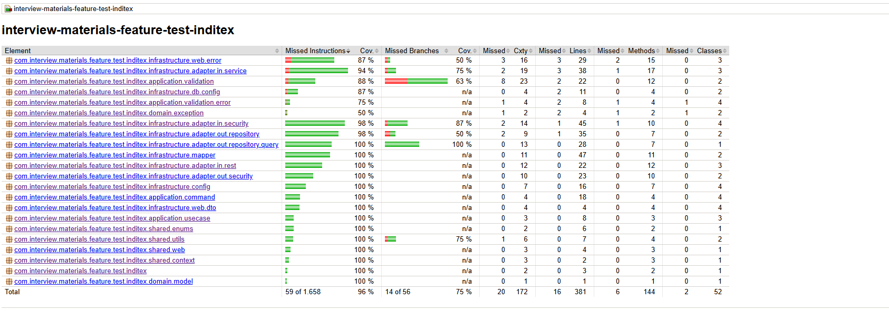

# Interview Materials Feature Test Inditex

## Overview

This project is an application designed to manage assets. It leverages modern technologies such as **Java**, **Spring Boot**, **R2DBC**, and **PostgresSQL** to provide a reactive and scalable solution. The application is containerized using **Docker** and includes comprehensive testing, logging, and error handling mechanisms.

---

## Architecture

The project follows a layered architecture:

1. **Controllers**: Handle HTTP requests and responses.
2. **Services**: Contain business logic.
3. **Use Cases**: Encapsulate specific application functionalities.
4. **Repositories**: Interact with the database using reactive programming.
5. **Infrastructure**: Includes configuration files and database initialization logic.
6. **Ports and Adapters**: Ensure modularity and flexibility by defining interfaces (ports) and their implementations (adapters) for communication between layers and external systems.
---

## Key Components

### Controllers

- **[`AssetGetRestControllerAdapter`](./src/main/java/com/interview/materials/feature/test/inditex/infrastructure/adapter/in/rest/AssetGetRestControllerAdapter.java)**: Handles GET requests to retrieve assets.
- **[`AssetPostRestControllerAdapter`](./src/main/java/com/interview/materials/feature/test/inditex/infrastructure/adapter/in/rest/AssetPostRestControllerAdapter.java)**: Handles POST requests to upload new assets.
- **[`LoginRestControllerAdapter`](./src/main/java/com/interview/materials/feature/test/inditex/infrastructure/adapter/in/rest/LoginRestControllerAdapter.java)**: Manages user authentication by handling login requests and returning JWT tokens.

### Services

- **[`GetAssetsServiceAdapter`](./src/main/java/com/interview/materials/feature/test/inditex/infrastructure/adapter/in/service/GetAssetsServiceAdapter.java)**: Provides logic to fetch assets from the database.
- **[`UploadAssetServiceAdapter`](./src/main/java/com/interview/materials/feature/test/inditex/infrastructure/adapter/in/service/UploadAssetServiceAdapter.java)**: Handles asset upload operations.
- **[`LoginServiceAdapter`](./src/main/java/com/interview/materials/feature/test/inditex/infrastructure/adapter/in/service/LoginServiceAdapter.java)**: Implements the authentication logic, validating user credentials and generating JWT tokens.

### Use Cases

- **[`GetAssetsByFilterUseCase`](./src/main/java/com/interview/materials/feature/test/inditex/application/usecase/GetAssetsByFilterUseCase.java)**: Implements filtering logic for asset retrieval.
- **[`UploadAssetUseCase`](./src/main/java/com/interview/materials/feature/test/inditex/application/usecase/UploadAssetUseCase.java)**: Encapsulates the asset upload process.
- **[`LoginUseCase`](./src/main/java/com/interview/materials/feature/test/inditex/application/usecase/LoginUseCase.java)**: Encapsulates the user authentication process, delegating credential validation and token generation to the service layer.

### Repositories

- **[`AssetRepositoryAdapter`](./src/main/java/com/interview/materials/feature/test/inditex/infrastructure/adapter/out/repository/AssetRepositoryAdapter.java)**: Manages database interactions for asset-related operations, using reactive programming with **R2DBC**.
- **[`LoginRepositoryAdapter`](./src/main/java/com/interview/materials/feature/test/inditex/infrastructure/adapter/out/repository/LoginRepositoryAdapter.java)**: Handles user-related database operations, including authentication and role management.

---

## Security

The application uses **Spring Security** to secure endpoints and manage user authentication. The security configuration is defined in the [`SecurityConfig`](./src/main/java/com/interview/materials/feature/test/inditex/infrastructure/config/SecurityConfig.java) class, which sets up basic authentication and restricts access to certain endpoints.

---

## Utilities

The [`DateUtils`](./src/main/java/com/interview/materials/feature/test/inditex/shared/utils/DateUtils.java) class provides utility methods for parsing and formatting dates. It ensures consistent handling of date formats across the application, particularly for filtering assets by date ranges. This utility is designed to handle edge cases and invalid date inputs gracefully.

---

## Traceability

The [`TraceIdHolder`](./src/main/java/com/interview/materials/feature/test/inditex/shared/context/TraceIdHolder.java) class is used to manage traceability across the application. It provides a mechanism to store and retrieve a unique `traceId` for each request, ensuring that logs and error responses can be correlated effectively. This enhances debugging and monitoring capabilities.

The [`TraceWebFilter`](./src/main/java/com/interview/materials/feature/test/inditex/shared/web/TraceWebFilter.java) integrates with **Spring WebFlux** to automatically generate and attach a `traceId` to incoming requests. This `traceId` is propagated throughout the application lifecycle, ensuring consistent traceability in logs and error handling.

---

## Error Handling

The application uses centralized [`GlobalErrorController`](./src/main/java/com/interview/materials/feature/test/inditex/infrastructure/web/error/GlobalErrorController.java) to log and respond to exceptions gracefully. Custom exceptions are logged using **SLF4J** and returned as meaningful HTTP responses.

### Error Codes

The following HTTP status codes are used across the application for error handling:

- **400 BAD REQUEST**:
  - `UnsupportedAssetContentTypeException`: Indicates that the asset's content type is not supported.
  - `InvalidDateRangeException`: Indicates that the provided date range is invalid.
  - `InvalidSortDirectionException`: Indicates that the sort direction is invalid.
  - `WebExchangeBindException`: Indicates validation errors in the request, providing detailed field-level error messages.
- **401 UNAUTHORIZED**:
    - `UnauthorizedException`: Indicates that the user is not authorized to access the requested resource.
- **403 FORBIDDEN**:
    - `ForbiddenException`: Indicates that the user does not have permission to access the requested resource.
- **404 NOT FOUND**:
  - `NoResourceFoundException`: Indicates that the requested resource could not be found.

- **500 INTERNAL SERVER ERROR**:
  - Unhandled exceptions or unexpected errors in the application are logged and returned with a generic error message.

### Error Response Format

The `ErrorResponse` class standardizes the structure of error responses, including:
- HTTP status code and reason.
- Error message.
- Timestamp of the error.
- Optional field-level validation errors.

This approach ensures consistent and informative error handling across the application.

---

## Logging

Logging is configured to provide detailed insights into application behavior, ensuring traceability and efficient debugging. Key aspects include:

- **Spring R2DBC**: Logs database interactions, including executed queries and their performance metrics. These logs are set to `DEBUG` level for detailed analysis.

- **PostgresSQL Queries**: SQL queries executed by R2DBC are logged at `DEBUG` level, allowing developers to monitor query execution and identify potential issues.

- **Traceability**: Each log entry includes a unique `traceId`, generated by the `TraceWebFilter` and propagated throughout the application lifecycle. This ensures that logs can be correlated with specific requests for better debugging and monitoring.

- **Error Handling Logs**: Exceptions are logged with detailed information, including the `traceId`, HTTP status, and error message. This is implemented in the `GlobalErrorController` to provide consistent and informative error logging.

This logging setup ensures comprehensive visibility into application operations and facilitates troubleshooting in production environments.

---

## Database Initialization

The [`R2dbcSchemaInitializer`](./src/main/java/com/interview/materials/feature/test/inditex/infrastructure/db/config/R2dbcSchemaInitializer.java) class initializes the database schema using the [`schema.sql`](./src/main/resources/schema.sql) file. Errors during initialization are logged.

---

## Testing

The project includes unit and integration tests to ensure the reliability and correctness of the application. Testing is performed using **JUnit** and **Mockito**, and the coverage is measured using **JaCoCo**.

### Types of Tests

- **Unit Tests**: Validate the behavior of individual components, such as classes or methods, in isolation. These tests ensure that each unit of code works as expected.

- **Integration Tests**: Verify the interaction between multiple components of the system, such as controllers and repositories. These tests ensure that modules work together coherently.

### Test Coverage

- **JaCoCo** is configured to generate detailed reports on code coverage, including:
  - **Line Coverage**: Percentage of executed lines of code.
  - **Branch Coverage**: Percentage of executed branches in conditional statements.
  - **Method Coverage**: Percentage of executed methods.

The coverage reports are generated in the `target/site/jacoco` directory after running the tests. These reports can be visualized in HTML format for easy analysis.

### How to Run Tests

1. Execute the following Maven command to run all tests and generate the coverage report:

   ```bash
   mvn clean test verify
   ```

   ```bash
   target/site/jacoco/index.html
   ```

  

---

## Configuration

### Application Properties

The application uses different configuration files to manage environment-specific settings, ensuring flexibility for both local development and Docker-based deployments.

#### Local Configuration

For local development, the application uses [`application.yaml`](./src/main/resources/application.yaml). This file configures an in-memory H2 database in PostgresSQL compatibility mode, along with settings for management endpoints and detailed logging for debugging purposes.

#### Docker Configuration

For Docker-based deployments, the application uses [`application-docker.yaml`](./src/main/resources/application-docker.yaml). This file sets up the connection to a PostgresSQL database hosted in a Docker container. It also includes connection pooling settings to optimize performance in production environments.

#### Key Differences

- **Database**: Local configuration uses an H2 in-memory database, while Docker connects to PostgresSQL.

These configurations ensure the application operates seamlessly across different environments.

## How to Run

### Local

To run the application locally, use the following Maven command:

```bash
mvn spring-boot:run
```

This will start the application with the default application.yaml configuration, which uses an in-memory H2 database. The database will be initialized with test data from the [`schema.sql`](./src/main/resources/schema.sql) . The application will be accessible at http://localhost:8080.
You can check the application health status with:

```bash
curl http://localhost:8080/actuator/health
```

### Docker

To run the application in a Docker environment, use the following steps:

1. Build the Docker image and Start the containers using docker-compose:

   ```bash
   docker-compose up -d
    ```
This will start the application with the docker profile, connecting to a PostgresSQL database container. The database will be initialized with test data from the [`schema.sql`](./src/main/resources/schema.sql) file. The application will be accessible at http://localhost:8080.
You can check the application health status with:

```bash
curl http://localhost:8080/actuator/health
```

### Postman Collection

The project includes a Postman collection [`AssetCollection.postman_collection.json`](./AssetCollection.postman_collection.json) to test API endpoints. It contains:
- **GET /assets**: Retrieve assets.
- **POST /assets**: Upload new assets.
- **POST /login**: Authenticate users.

## Future Improvements

- **Resilient**: Implement retry mechanisms and circuit breakers using libraries like **Resilience4j** to handle transient failures and improve system reliability. Add fallback methods to ensure graceful degradation during service interruptions.
- **Pagination**: Add pagination support to the API responses to handle large datasets efficiently. Use query parameters like page and size to control the pagination behavior.
- **CQRS**: Introduce the **Command Query Responsibility Segregation** pattern to separate read and write operations, improving scalability and maintainability. Use dedicated models and services for queries and commands.
- **Event Driven**: Integrate **Apache Kafka** or **RabbitMQ** for event-driven architecture, enabling asynchronous communication between microservices and ensuring reliable message processing for high-throughput scenarios.